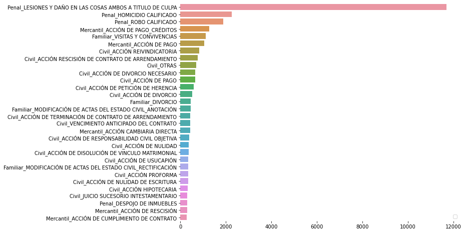

# webscrapping_sentencias_stjjalisco
Estos scripts descargan las sentencias públicas del delito que el usuario ingrese del Supremo Tribunal de Justicia del Estado de Jalisco.

- delitos_stjjalisco_dict.csv: es una lista del número de sentencias de cada delito del portal
- dict_toca_data.txt: es la estructura json de cada sentencia
- list_nombres_delitos.txt: es la lista de todos los tipos de delitos y su materia adentro del portal
- stjjalisco_sentencias_dict.ipynb: un notebook que genero la lista del número de sentencias de cada delito adentro del portal
- stjjalisco_sentencias_webscraping: es el script que descarga las sentencias en formato pdf del delito/materia especificado por el usuario

